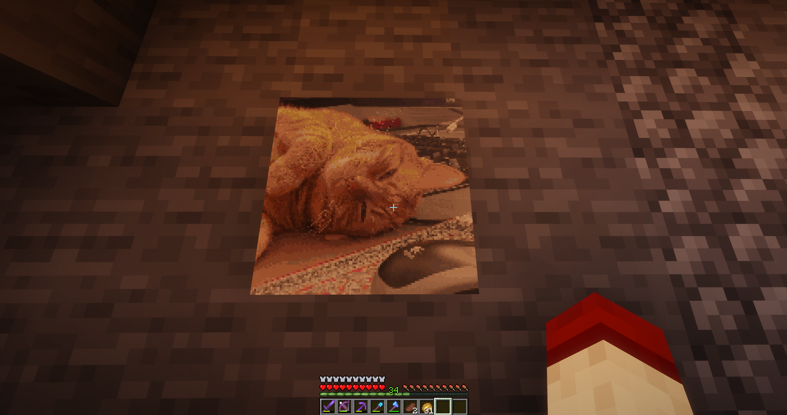

# map-paint
Simple plugin for Minecraft Spigot servers that allows people to convert maps into paintings. Tested and works in 1.16.5 servers. 
Simply hold an opened map (not empty), then run `/paintmap image_url` to render the image onto the map. You can then hang them on item frames! 
## Example
